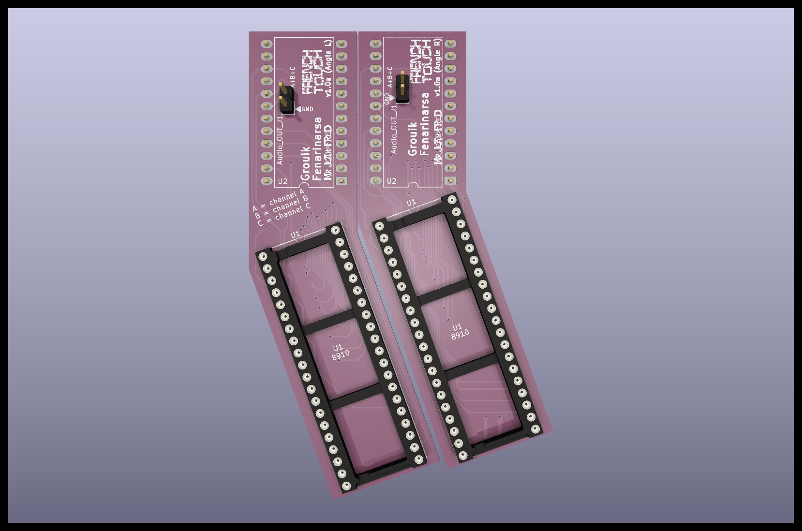

# AY-3-8913 to AY-3-8910 Adapter

A simple adapter to replace the AY-3-8913 with the AY-3-8910 (or the YM2149)

## Why to replace the AY-3-8913 ?
If you've read this article https://www.fenarinarsa.com/?p=3183, you know that there's a chance your Mockingboard with AY-3-8913 will sound *weird* under certain circumstances.

Here a short video to hear the difference between a faulty AY-3-8913 and an AY-3-8910 in action (featuring Digidream 2): https://youtu.be/_qslugOY2Dw

That's why we decided to do an adapter to easily replace the AY-3-8913 with the AY-3-8910 (or the YM2149) which does not suffer from the same issue and is more readily available.
We have made several designs giving you the choice for your use!
And they can of course be used as a basis for your own project! 

**Note about the Phasor Card**: these adapters are designed to be used primarily on a *Mockingboard*. For the *Phasor*, as there are 4 AY-3-8913s potentially to be replaced, it will probably be necessary to use a *daughter board* as adapter. This is beyond the scope of this project (for now...)

## Credits:  
Original idea: French Touch (grouik/fenarinarsa)  
http://fr3nch.t0uch.free.fr/  
Final design (and all the hard work!): Mr Jean-Fred  
https://github.com/Jean-Fred64

*French Touch would especially like to thank Mr Jean-Fred, without whom this project would never have been possible. It's thanks to him that an embryonic schematic was transformed into a viable project!*

## License:
GNU GENERAL PUBLIC LICENSE 3

## Reference:
Datasheets:  
AY-3-8910: https://map.grauw.nl/resources/sound/generalinstrument_ay-3-8910.pdf  
YM2149: http://www.ym2149.com/ym2149.pdf  

Mockingboard Info:  
https://en.wikipedia.org/wiki/Mockingboard
https://www.reactivemicro.com/product/mockingboard-assembled-or-kit/

Manufacturing PCB:  
https://www.kicad.org/  
https://jlcpcb.com/  
https://www.pcbway.com/

----  
## PCB designs :

## "Angle" version for Mockingboard (Two different PCBs for each AY-3-8913)

 
**LEFT** for *top* AY-3-8913:

**RIGHT** for *bottom* AY-3-8913:

- to replace one or **two** AY-3-8913 on your Mockingboard.
- you must use each version for the TOP and BOTTOM AY-3-8913 on your Mockbingboard.
- note: pay attention to the insertion direction of the AY-3-8910 on the adapter.

----  

## "Triangle" version for Mockingboard (A single PCB for the two AY-3-8913s)

- alternative (and ultimate) version to replace the TWO AY-3-8913 on the Mockingboard on the same board.

----
## "Normal" general version

- to replace only **one** AY-3-8913 on the Mockingboard (the **bottom** one only!).
- to replace the AY-3-8913 on other machines (for example: some old Pinball *soundcards*).
- note: pay attention to the insertion direction of the AY-3-8910 on the adapter.

- **WARNING**: do not use this model if you want to replace the **TWO** AY-3-8913s on your Mockingboard because you will not be able to close the Apple II cover! Use the other designs instead!